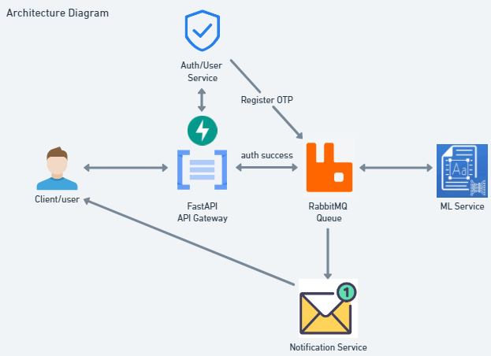

# fastapi-react-rabbitmq

## This POC application is a microservice-based application that uses FastAPI, React, and RabbitMQ.
The backend is divided into four microservices: Gateway, ML, Auth, and Notification. The frontend is a React application that communicates with the Gateway service to interact with the backend. RabbitMQ is used for communication between the microservices. The user can register, verify their email, and upload an image to extract text from it. The extracted text is then sent to the user via email. 

## Backend

The backend consists of four main services:

- **Gateway Service:** This service acts as the entry point for all incoming requests. It routes requests to the appropriate microservices and handles the overall orchestration of the application.
- **ML Service:** The ML service is responsible for processing image data. It uses Keras OCR to extract text from images and communicates with the Gateway Service to receive image data and send back the extracted text.
- **Auth Service:** The Auth service handles user authentication and email verification. It includes functionality for registering users, generating and verifying OTPs, and ensuring email verification.
- **Notification Service:** This service is responsible for sending emails to users. It is triggered when processes are completed .

## Frontend
The frontend is a React-Vite application that communicates with the Gateway service to interact with the backend. The user can register, verify their email, and upload an image to extract text from it. The extracted text is then sent to the user via email.

## Architecture Diagram


## Project Setup Instructions
- **postgres database setup using docker**
  - Make sure that system has docker installed on it.
  - open cmd and enter below command
```
docker run --name postgres-db -e POSTGRES_PASSWORD=12 -d -p 5432:5432 postgres
```
- **RabbitMQ setup using docker**
  - Make sure that system has docker installed on it.
  - open cmd and enter below command
```
docker run -it --rm --name rabbitmq -p 5672:5672 -p 15672:15672 rabbitmq:3.13-management
```
- **Fork and Clone the repo using**
```
https://github.com/Mufaddal2153/fastapi-react-rabbitmq.git
```

## Backend Setup Instructions

- **Install the Dependencies from `requirements.txt`**
- **Make sure your system has python 3.11.8 installed and before installing dependencies make sure your virtual environment is activated for each microservice .**
```
 cd backend
 pip install -r requirements.txt 
```
- **Run the Server for each micro-service using following command**
```
 cd auth/
 python main.py

 cd gateway/
 python main.py

 cd ml/
 python main.py

 cd notification/
 python main.py
```

## Frontend Setup Instructions
- **Install the Dependencies**
```
cd frontend
npm install
```
- **Run the Server**
```
npm run dev
```